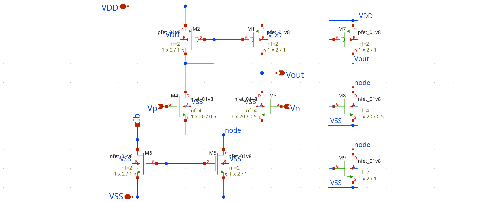
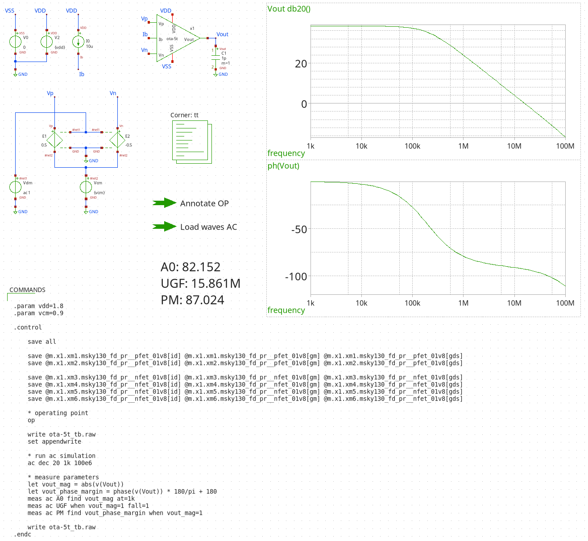
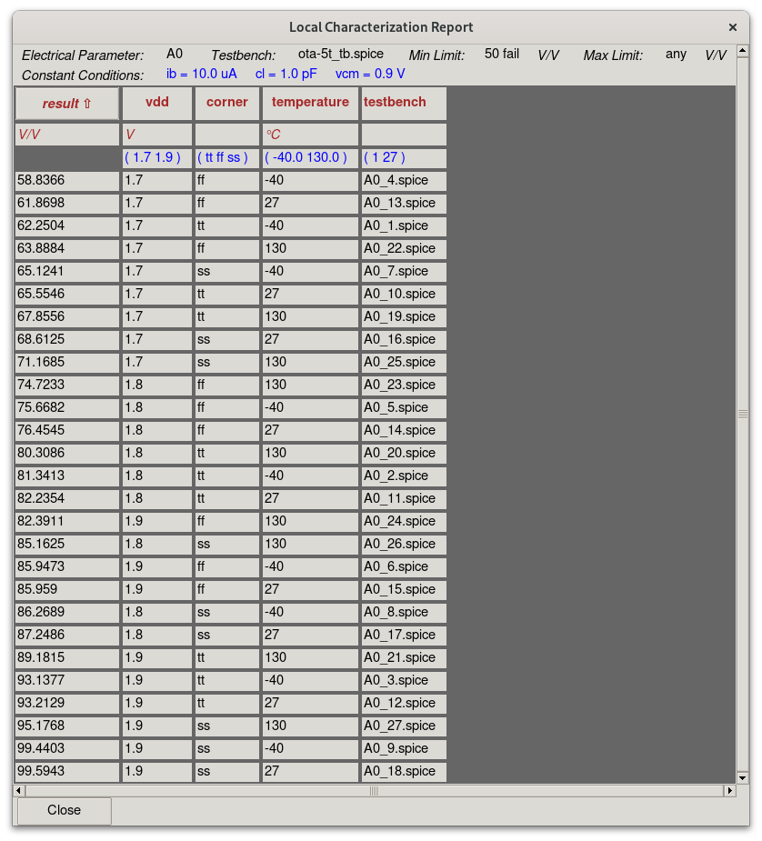

# CACE Setup for a 5T-OTA

```{warning}
This tutorial is currently outdated. Please take a look at the [ota-5t](https://github.com/mole99/ota-5t) directly and use [sky130_ef_ip__template](https://github.com/efabless/sky130_ef_ip__template) as a starting point for your analog projects.
```

This tutorial will guide you step by step through the creation of a simple 5-transistor OTA and the CACE setup for it.
It is assumed that you have already set up CACE and its dependencies.

## Getting Started

In this tutorial we will design a simple circuit, the "Hello World!" of analog design, a 5-transistor OTA, and set up CACE for it.

The source files for this project are available at [ota-5t](https://github.com/mole99/ota-5t). You can simply follow along and compare with this reference in case of problems.

It is assumed that you work within the `nix-shell` provided by CACE and that you have installed the Sky130A PDK. If not, please take a look at the Installation Overview to install Nix and enable the shell. For the installation of the PDK you can use e.g. [volare](https://github.com/efabless/volare).

After you have installed the PDK and activated the `nix-shell`, you must export `PDK_ROOT` so that it points to the installation directory and export `PDK` to the name of the PDK being used. If the PDK was installed using volare, you can set `PDK_ROOT` to:

```console
export PDK_ROOT=~/.volare
export PDK=sky130A
```

This tutorial starts with the creation of a schematic and symbol for the OTA. The next step is to create the design testbench and to draw the layout. If you are already familiar with this, you can skip this part and start directly at [](#creating-the-cace-datasheet). Then, the CACE set up is created: It consists of a datasheet for the OTA and a template testbench.

---

As the first step, create a folder and name it `ota-5t`. The reason for the name of the folder is that CACE takes the name of the current directory when it is called and searches for a corresponding data sheet under `cace/<design_name>.yaml`. In our case, this is `cace/ota-5t.yaml`, which we will create later. Another option is to use a generic name for the project directory and tell cace where to find the datasheet. This is useful if you have multiple designs and datasheets in just one project folder.

At the end of this tutorial, the top-level directory structure should look like this:

```
.
├── cace
├── gds
├── netlist
├── runs
└── xschem
```

In the following sections, we will create the subfolders one by one. The `cace` folder contains everything that is CACE-specific: the datasheet, custom scripts and template testbenches. In `gds` we will create the layout for the OTA. The `netlist` folder is generated by CACE and contains the different netlist sources of your design, e.g. the schematic netlist, the layout-extracted netlist, the C-extracted netlist and the R-C-extracted netlist for full parasitic extraction. The `runs` folder is generated by CACE and contains all files for each run with a timestamp, e.g. `RUN_2024-06-17_12-45-27`. Finally, the design schematic, the design testbench, as well as the symbol file are stored under `xschem`.

Adding a `README.md` and `LICENSE` to your repository is good practice.

## Creating the Schematic

For schematic entry we choose to use [xschem](https://github.com/StefanSchippers/xschem).

Create the folder `xschem` in the root directory, before we start xschem we need to create an xschemrc file here.

```
# Source the PDK xschemrc file
if {![info exists PDK]} {
    source $env(PDK_ROOT)/$env(PDK)/libs.tech/xschem/xschemrc
}

# Add current directory to xschem library path
append XSCHEM_LIBRARY_PATH :[file dirname [info script]]
```

This file will be automatically sourced if you start xschem in the same directory. If not you need to specify it via `--rcfile`.

```{note}
Why is this necessary? The reasons are twofold: Firstly, the PDK is automatically sourced and secondly, the `xschem/` directory is added to the XSCHEM_LIBRARY_PATH. This is necessary so that all symbol references in the schematic are relative and therefore portable.
```

Next, go to `ota-5t/xschem/` and start xschem using:

```console
xschem ota-5t.sch
```

This command starts xschem and automatically sources the xschemrc file we created before.
You will be greeted by a blank window since `ota-5t.sch` did not exist before. Save the schematic to create this file.

We need to replicate this schematic:



The transistors M6 and M5 make up the current mirror, where M6 is not counted as transistor for the 5-T OTA. M4 and M3 form the differential pair, and M2 and M1 are the active load. The three individual transistors on the right side are only dummies and have no real functionality but to improve the performance of the circuit after manufacturing. The `nf` attribute specifies the number of fingers for each transistor, we will group them together in the layout.

If you need help with placing symbols and connecting wires, please refer to the [xschem manual](https://xschem.sourceforge.io/stefan/xschem_man/xschem_man.pdf).

```{note}
You can get the completed schematic from [here](https://github.com/mole99/ota-5t/tree/main/xschem).
```

## Creating the Symbol

The easiest way to create a symbol from your schematic is to press `A` while you have the schematic open. Xschem will ask you if you want to make a symbol view from the schematic. Press OK.

Now, try to replicate this symbol:


```{note}
You can get the completed symbol from [here](https://github.com/mole99/ota-5t/tree/main/xschem).
```

## Creating the Design Testbench

In CACE, we distinguish between the *design testbench* and the *template testbench*.

The design testbench is used during the development of your design, here it makes sense to place graphs and other helpful widgets to debug your circuit.

The template testbench contains placeholder variables and cannot be run on its own. CACE uses it to generate testbenches for all conditions. More about the template testbench under [](#creating-the-template-testbench)

Start xschem from `ota-5t/xschem/`:

```console
xschem ota-5t_tb.sch
```

Again, try to replicate the design testbench:



```{note}
You can get the completed design testbench from [here](https://github.com/mole99/ota-5t/tree/main/xschem).
```

## Drawing the Layout

Now we come to the layout phase. You can us either [magic](https://github.com/RTimothyEdwards/magic) or [KLayout](https://www.klayout.de/) to draw the layout of your design.

In this tutorial, we have chosen to draw the layout using KLayout and used the PCells provided by the sky130A PDK.

```{warning}
If you are using KLayout and PCells, please make sure to convert the layout to a static version for parasitic extraction with magic. We have provided a simple script `make_pcells_static.py` to do this.
```

The layout of the OTA uses various matching techniques to improve the real-life performance:

- Interdigitized layout
- Common centroid layout
- Dummy transistors

Try to replicate the layout of the OTA:


```{note}
You can get the completed layout from [here](https://github.com/mole99/ota-5t/tree/main/gds).
```

## Creating the CACE Datasheet

Finally, we come to the CACE part of this tutorial. The first step of the CACE setup is to create a datasheet for your design. The datasheet contains documentation about your design and the parameters you want to measure and under what conditions. The datasheet will be used as input for CACE.

Let's start with the header. As you can see, it contains basic information about the design, the CACE format version, information about the author and project paths. The paths tell CACE where to find the schematic (`xschem/`) and the layout (`gds/`). The `netlist` path tells CACE where to generate the different netlists for the schematic, layout and parasitic extraction. CACE can also export your datasheet, in this case under `doc`. 

```yaml
#--------------------------------------------------------------
# CACE circuit characterization file
#--------------------------------------------------------------

name:           ota-5t
description:    A simple 5-transistor OTA
PDK:            sky130A

cace_format:    5.2

authorship:
  designer:         Leo Moser
  company:          Efabless
  creation_date:    May 27, 2024
  license:          Apache 2.0

paths:
  root:             ..
  schematic:        xschem
  layout:           gds
  netlist:          netlist
  documentation:    doc

```

This section is optional, but recommended, as CACE compares the pins with the schematic of your design. You can specify as much or as little per pin as you like.

```yaml

pins:
  VDD:
    description: Positive analog power supply
    type: power
    direction: inout
    Vmin: 1.7
    Vmax: 1.9
  VSS:
    description: Analog ground
    type: ground
    direction: inout
  Ib:
    description: Bias current input
    type: signal
    direction: input
  Vp:
    description: Voltage positive input
    type: signal
    direction: input
  Vn:
    description: Voltage negative input
    type: signal
    direction: input
  Vout:
    description: Voltage output
    type: signal
    direction: output
```

CACE generates a testbench for each set of conditions. As not every parameter has to change in each condition, you can specify default conditions that are used if no conditions are specified in the parameter.

```yaml
default_conditions:
  vdd:
    description: Analog power supply voltage
    display: Vdd
    unit: V
    typical: 1.8
  vcm:
    description: Input common mode voltage
    display: Vcm
    unit: V
    typical: 0.9
  ib:
    description: Bias current
    display: Ib
    unit: uA
    typical: 10
  cl:
    description: Output load capacitance
    display: CLoad
    unit: pF
    maximum: 1
  corner:
    description: Process corner
    display: Corner
    typical: tt
  temperature:
    description: Ambient temperature
    display: Temp
    unit: °C
    typical: 27
```

Finally, we arrive at the parameters section. Here you can specify parameters for which CACE runs simulations using the `ngspice` tool. Each entry consists of a description, limits for the parameter so that it can be evaluated (✅/❌), the simulation section and the conditions for this parameter.

The simulate section specifies which simulator and template testbench to use (`ota-5t_tb.spice`, we will create it in the next section) and the format of the output (`ascii`) as well as its file extension (`.data`). The output file can contain multiple values, therefore we need to tell CACE which one to use. In the case of the first parameter, the first value is the result (`[result, 'null', 'null']`).

Finally, the conditions are specified in either `minimum`/`typical`/`maximum` notation, or by enumeration. For the `corner` condition, we could also add the remaining corners `fs` and `sf` if we would like to. These conditions replace the corresponding default conditions. CACE generates a simulation testbench for each combination of conditions. Since we have specified 3 values for `corner` and 3 values for `temperature`, a total of 3*3=9 simulations are started and evaluated against the limits. If we were to add `vdd` as a condition with 3 different values, we would have a total of 3*3*3=27 simulations for this parameter.

```yaml
parameters:
  dc_params:
    spec:
      a0:
        display: DC gain
        description: The DC gain of the OTA
        unit: V/V
        minimum:
          value: 50
        typical:
          value: any
        maximum:
          value: any
      ugf:
        display: Unity Gain Frequency
        description: The unity gain frequency of the OTA
        unit: Hz
        minimum:
          value: 1e6
        typical:
          value: any
        maximum:
          value: any
      pm:
        display: Phase Margin
        description: The phase margin of the OTA
        unit: °
        minimum:
          value: 60
        typical:
          value: any
        maximum:
          value: any
    tool:
      ngspice:
        template: ac.sch
        format: ascii
        suffix: .data
        variables: [a0, ugf, pm]
    plot:
      gain_vs_temperature:
        type: xyplot
        xaxis: temperature
        yaxis: a0
      phase_margin_vs_corner:
        type: xyplot
        xaxis: corner
        yaxis: pm
    conditions:
      corner:
        enumerate: [tt, ff, ss] # fs, sf
      temperature:
        minimum: -40
        typical: 27
        maximum: 130
```

CACE has also support for other tools which evaluate properties of the layout such as area, width, length, DRC and LVS. They also specify a limit, whereby for DRC and LVS only a maximum of 0 makes any sense at all.

```yaml
  magic_area:
    spec:
      area:
        display: Area
        description: Total circuit layout area
        unit: µm²
        maximum:
          value: 600
      width:
        display: Width
        description: Total circuit layout width
        unit: µm
        maximum:
          value: any
      height:
        display: Height
        description: Total circuit layout height
        unit: µm
        maximum:
          value: any
    tool:
      magic_area

  magic_drc:
    description: Magic DRC
    display: Magic DRC
    spec:
      drc_errors:
        maximum:
          value: 0
    tool:
      magic_drc

  netgen_lvs:
    description: Netgen LVS
    display: Netgen LVS
    spec:
      lvs_errors:
        maximum:
          value: 0
    tool:
      netgen_lvs:
        script: run_project_lvs.tcl

  klayout_drc_full:
    description: KLayout DRC full
    display: KLayout DRC full
    spec:
      drc_errors:
        maximum:
          value: 0
    tool:
        klayout_drc:
            args: ['-rd', 'feol=true', '-rd', 'beol=true', '-rd', 'offgrid=true']
```

And that's it! Adding a new parameter is as simple as duplicating an existing parameter and customizing it (and perhaps creating a new template testbench). If you take a look at the example repository you will find even more parameter definitions.

## Creating the Template Testbench

Create the `templates` folder under `ota-5t/cace/` and create an xschemrc file with the following content:

```
# Source project xschemrc
source [file dirname [info script]]/../../xschem/xschemrc
```

This makes sure that the xschemrc file under `xschem/` is sourced so that we have access to the symbol of our design.

Next, start xschem from `ota-5t/cace/templates/`:

```console
xschem ota-5t_tb.sch
```

Try to replicate the template testbench:


```{note}
You can get the completed template testbench from [here](https://github.com/mole99/ota-5t/tree/main/cace/templates).
```

## Running CACE

### Command Line Interface

To start CACE in the command line for our design, simply invoke CACE from the `ota-5t` folder. By default, it will find the corresponding datasheet under `cace/ota-5t.yaml`.

```console
$ cace
```

You should get an output similar to the one shown here:


After CACE has finished, you will get a summary for all parameters, telling you whether they passed or failed:


By default, CACE uses the "best" netlist available. Since we provided a layout, this is the R-C-extracted netlist of our design called "rcx". You can also explicitly pass the netlist source to be used, e.g. for "schematic", via `--source`. CACE also supports running of only a subset of the available parameters with `--parameter`.

```console
$ cace --source schematic --parameter a0 pm
```

For troubleshooting, I like to lower the log level to "DEBUG" and only ever run one parameter in parallel. Since the simulations of a parameter also run in parallel, I set `--sequential` to run them one after another.

```console
$ cace --source rcx --log-level DEBUG \
       --parallel-parameters 1 --sequential
```

<!---

### Graphical User Interface

To start CACE using the GUI, just run the following from the `ota-5t` folder:

```console
$ cace-gui
```

This opens the GUI where you can select various parameters to run:


Once a parameter has completed you can click on "done" to obtain the results of individual runs:



If you click on one of the column headings, you will get a plot of the selected variable with the result:


-->

## Final Thoughts

We hope this tutorial was able to give you an introduction to setting up and using CACE. If you already designed an IP block, you can add a CACE setup to it. Or you could try adding CACE to your next design. Have fun!

```{note}
Did you notice any issues with this tutorial or have ideas for improvements? Please open an [issue](https://github.com/efabless/cace/issues) so we can improve this tutorial. Thank you!
```
