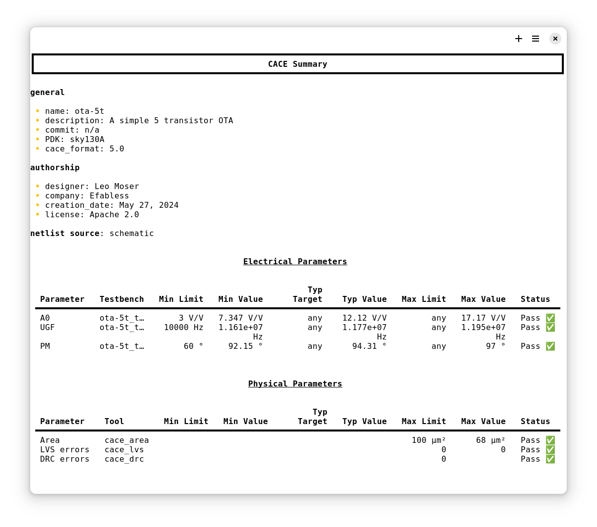

# Command Line Interface

CACE can be run directly from your command line:

```console
$ cace [<datasheet>] [<output>] [options]
```

Where `<datasheet>` is an input specification in YAML (`*.yaml`) and `<output>` is an optional file path under which the output file is to be saved. If `<datasheet>` is not specified, CACE searches for a file with the same name as the current directory under `cace/` with the file extension `.yaml`.

Options may be one of:

```console
--source=schematic|layout|rcx|all|best
--param=<parameter_name> <parameter_name> ...
--force
--json
--keep
--debug
--sequential
--no-simulation
--summary
```

When run from the top level, this program parses the CACE characterization file, runs simulations for the specified parameters or all if none are given, and outputs a modified file annotated with characterization results.

The option `--source`, restricts characterization to the specific netlist source, which is either schematic capture,
layout extracted, or full R-C parasitic extracted. If not specified, then characterization is run on the full R-C
parasitic extracted layout netlist if available, and the schematic captured netlist if not (option "best").

```console
positional arguments:
  datasheet             input specification datasheet (YAML)
  output                output specification datasheet (YAML)

options:
  -h, --help            show this help message and exit
  --version             show program's version number and exit
  -s {schematic,layout,rcx,all,best}, --source {schematic,layout,rcx,all,best}
                        choose the netlist source for characterization. By default, or when using 'best', characterization is run on
                        the full R-C parasitic extracted netlist if the layout is available, else on the schematic captured netlist.
  -p PARAMETER [PARAMETER ...], --parameter PARAMETER [PARAMETER ...]
                        run simulations on only the named parameters, by default run all parameters
  --parallel_parameters PARALLEL_PARAMETERS
                        the maximum number of parameters running in parallel
  -f, --force           force new regeneration of all netlists
  -k, --keep            retain files generated for characterization
  --no-plot             do not generate any graphs
  --debug               generate additional diagnostic output
  -l {ALL,DEBUG,INFO,WARNING,ERROR}, --log-level {ALL,DEBUG,INFO,WARNING,ERROR}
                        set the log level for a more fine-grained output
  --sequential          runs simulations sequentially
  --no-simulation       do not re-run simulations if the output file exists. (Warning: Does not check if simulations are out of date)
  --no-progress-bar     do not display the progress bar
```

This is an example output of CACE running the characterization for a simple OTA:


