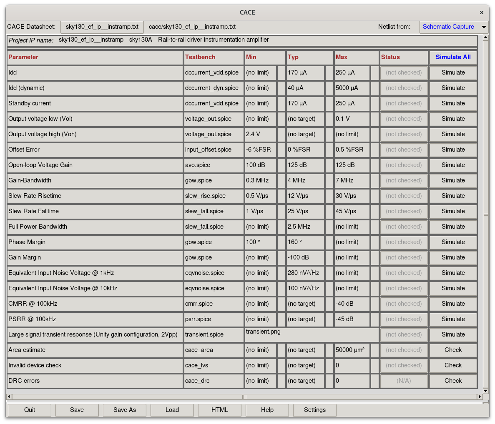

# Graphical User Interface

CACE has also support for a graphical user interface, started via:

```console
$ cace-gui [datasheet] [options]
```

Where `<datasheet>` is an input specification in YAML (`*.yaml`). If `<datasheet>` is not specified, CACE searches for a file with the same name as the current directory under `cace/` with the file extension `.yaml`. If none is found, the GUI window will come up without content. Click on the button with text `(no selection)` to find and select a characterization file to load.

There may be multiple characterization files in a single project (repository), as a project may contain multiple subcircuits that may need independent characterization or be able to be used as standalone circuits, or a project may simply be a collection of circuits (library) without a specific single top level.



```{include} characterization.md
:heading-offset: 1
```
